# 华南理工大学财务系统UI小助手
本小助手用于解决网上报账系统、财务查询系统的UI错位和缺少执行批量动作功能的问题。

小助手通过浏览器扩展（插件）tampermonkey（油猴）实现对用户端网页进行UI调整和功能补充，不会也无法修改服务器端数据，不涉及修改用户输入数据。仅为用户提供便利。

小助手完全开源，大家可以自由修改，代码详见：scut-finance-helper.user.js

使用本小助手前，请认真阅读源代码，并了解其含义。代码主要由GPT编写，如因使用小助手造成问题，由用户自行负责。

## UI小助手主要功能：
### 1.网上报账系统-批量删除发票功能
#### 使用前
默认情况下，我的票夹页面中缺少批量删除功能。
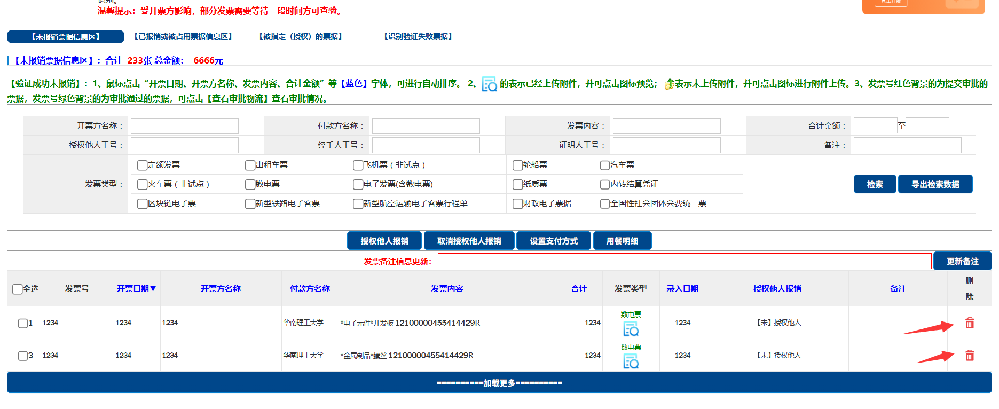
#### 使用后
添加批量删除选中发票功能，这样就不用一个个点删除了
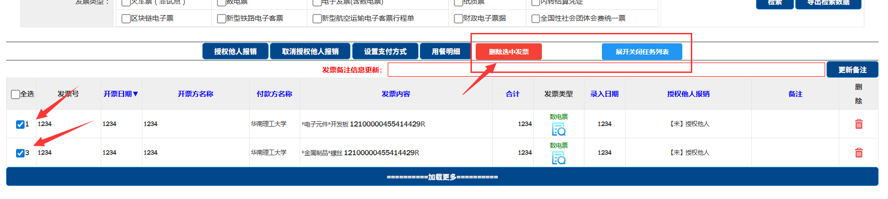

### 2.网上报账系统-批量绑定/取消绑定发票功能
#### 使用前
默认情况下，税票录入（绑定发票）页面中缺少批量绑定发票功能。
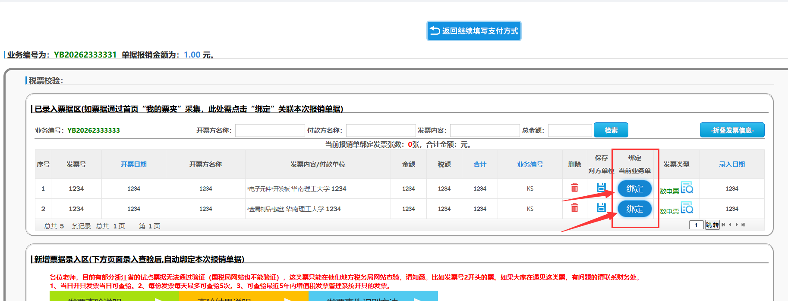
#### 使用后
添加批量绑定、批量解绑当前页面的发票功能，这样就不用一个个点绑定了
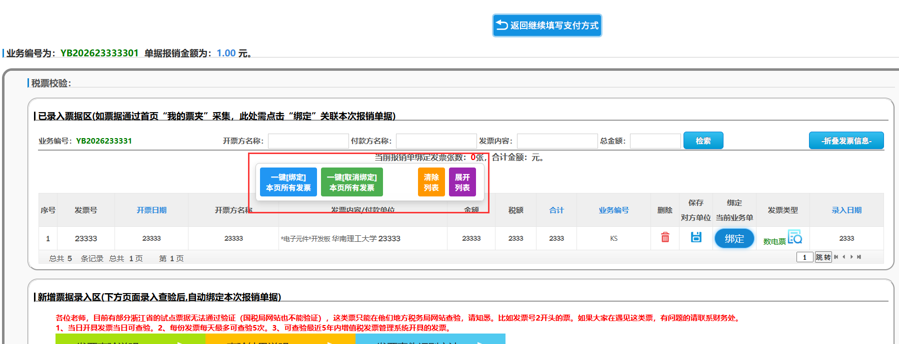

### 3.网上报账系统-自动选中日常报销中已添加经费
#### 使用前
默认情况下，在日常报销中编辑一个已经部分录入的单据，它不好自动选择唯一的经费，还要多点一下
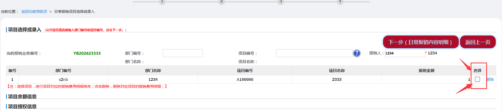
#### 使用后
有且仅有1个已录入经费时候，脚本会帮你自动选择经费。
有多个经费的时候，不会自动选择。

### 4.网上报账系统UI修正-日常报销-项目选择（经费选择）页面表格高度问题
#### 使用前

#### 使用后

### 5.网上报账系统UI修正-日常报销-费用明细页面表格高度问题
#### 使用前
默认情况下，在日常报销中填写费用明细页面，存在2个垂直方向的滑动条，导致操作困难。
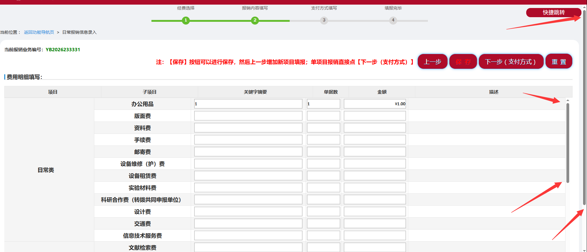
#### 使用后
将费用明细表格高度修正，减少1个滑动条。
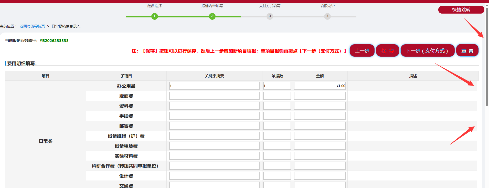

### 6.网上报账系统UI修正-税票录入（绑定发票）页面高度问题
#### 使用前
默认情况下，在税票录入（绑定发票）页面中，存在2个垂直方向的滑动条，导致操作困难。
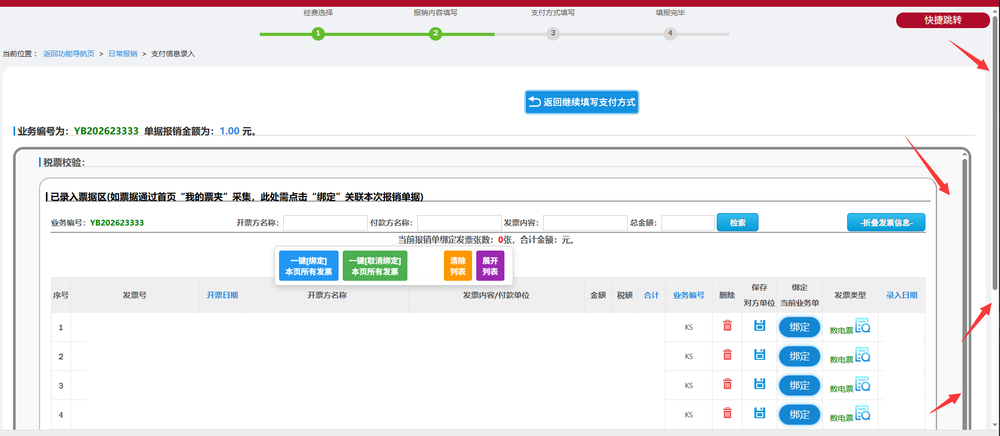
#### 使用后
将绑定发票页面高度修正，减少1个滑动条。

### 7.财务查询系统UI修正-首页表格错位问题
#### 使用前

#### 使用后

### 9.财务查询系统UI修正-表格无法完全展开问题
#### 使用前

#### 使用后

## 安装使用方法
### 安装浏览器扩展-tampermonkey
chrome浏览器打开应用商店：
https://chromewebstore.google.com/detail/tampermonkey/dhdgffkkebhmkfjojejmpbldmpobfkfo

edge浏览器打开应用商店：
https://microsoftedge.microsoft.com/addons/detail/%E7%AF%A1%E6%94%B9%E7%8C%B4/iikmkjmpaadaobahmlepeloendndfphd

### 安装好浏览器插件后，需要启用开发者模式，允许脚本注入
1.进入管理扩展程序页面

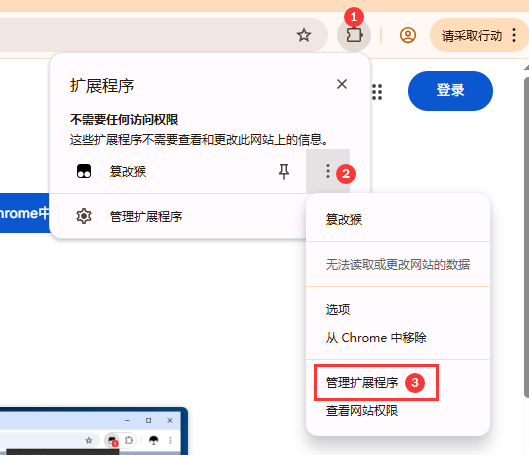

2.启用[开发者模式]、启用[允许运行用户脚本]，并建议启用[固定到工具栏]

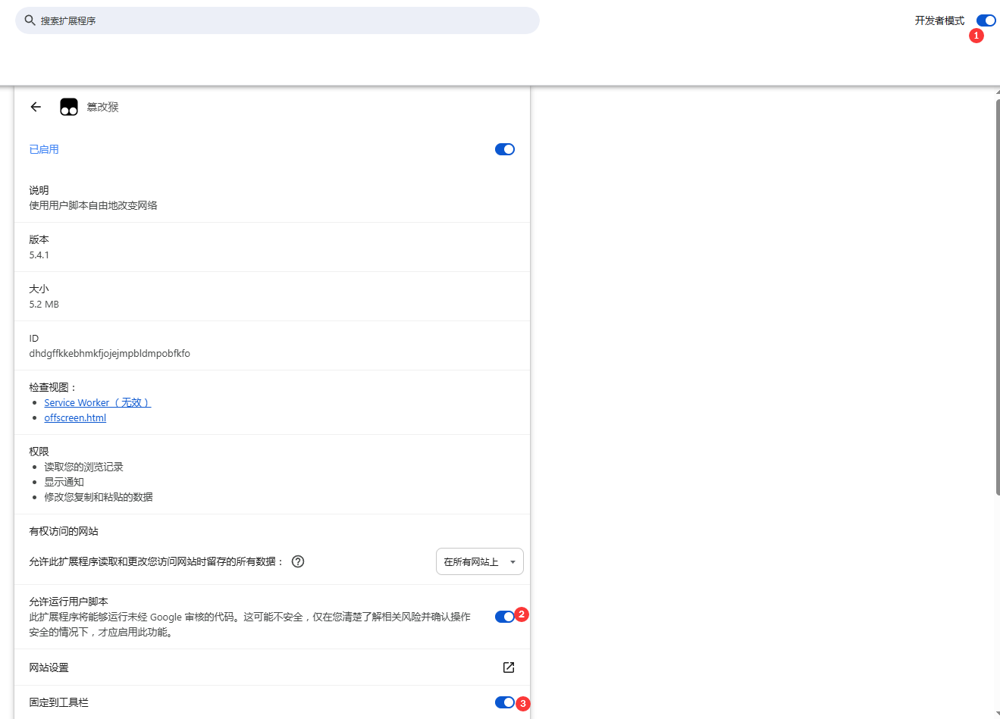

### 添加js脚本
点击按钮一键安装脚本

### 启用各个功能 默认情况下所有功能均为**禁用**
大家可以按需启用各个功能，默认情况下各个功能均为禁用（⛔）。
点击需要的功能后，会转化为启用（✅）

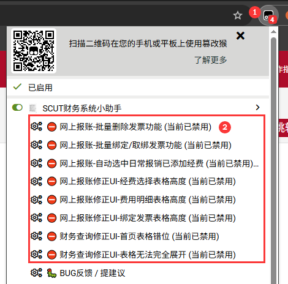

